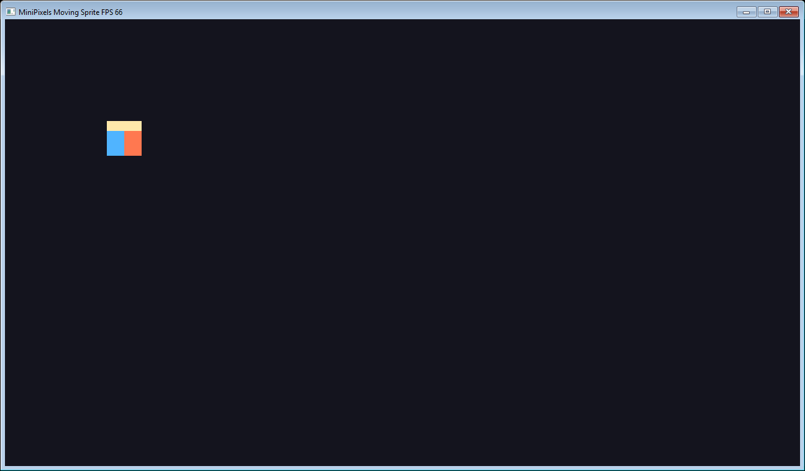
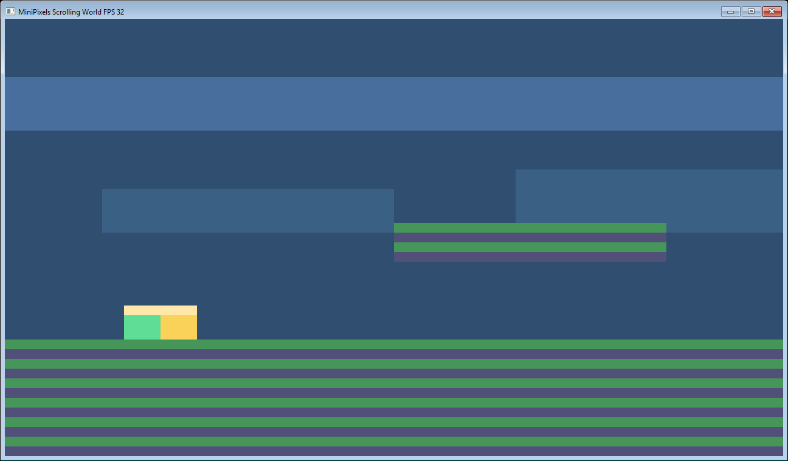
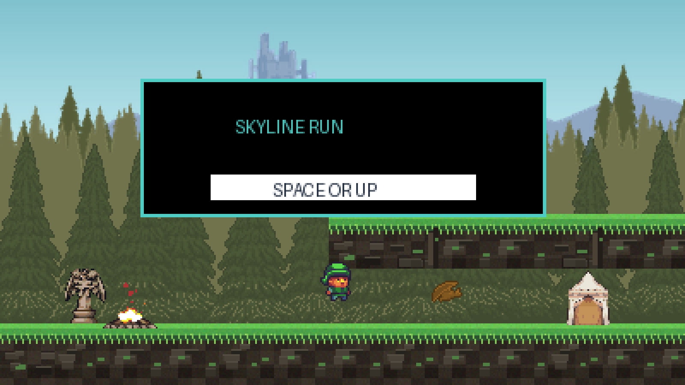
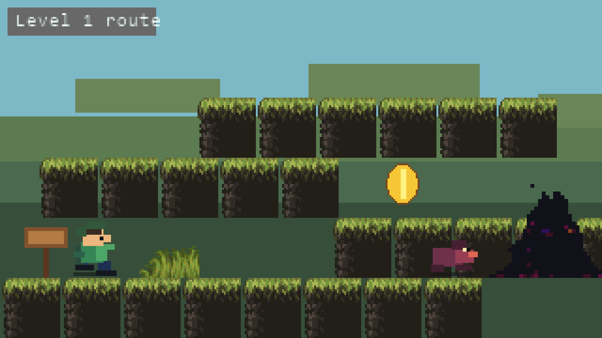
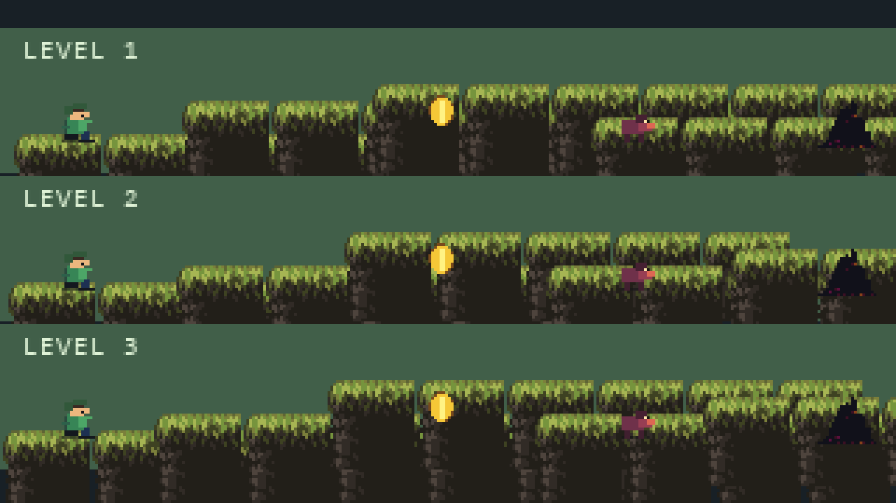
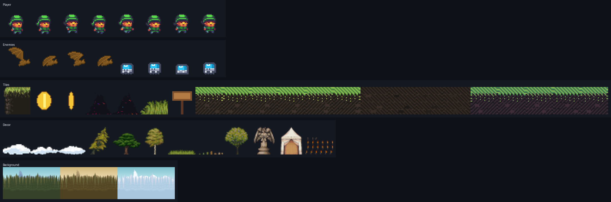
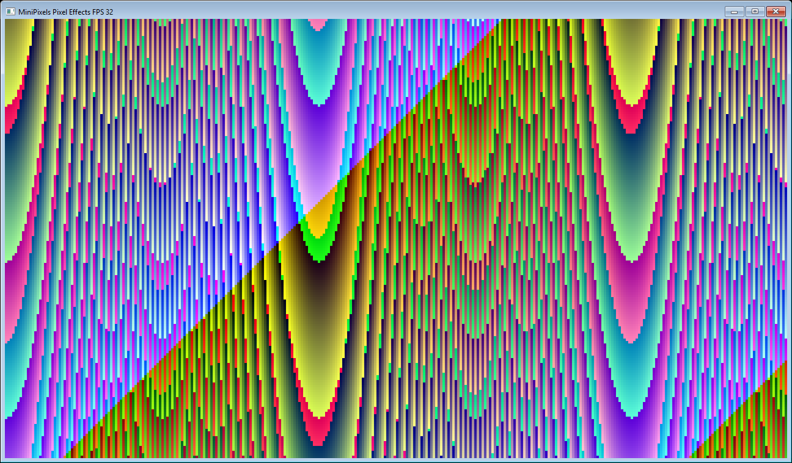

# MiniPixels

[](LICENSE)
[](.)

Current version: `0.12.0`

See the [0.12.0 release notes](RELEASE_NOTES_0.12.0.md) for lazy random-access asset loading, MPX3 protection, generated O(1) slot access, and cache controls.

MiniPixels is a pixel-oriented 2D game engine prototype for MiniLang. It uses MiniLang Compiler 1.2.7 or newer and builds native Windows x64 PE and Linux x64 ELF executables.

MiniPixels focuses on a small but working 2D engine slice: native Win32 and X11 windows, fixed/native/scaled framebuffers, OpenGL/WGL, GDI and XImage presentation, an optional batched Windows GPU scene canvas, configurable keyboard/mouse actions, sprites and rotated render targets, signed and optionally encrypted asset packs, localized text and generated game data, scene stacks, swept tile collision, bitmap text, multi-voice WAV/MP3 audio through waveOut or ALSA, headless tests, and example projects.



## API documentation

Browse the committed [MiniDoc API reference](docs/api/markdown/README.md), or
open `docs/api/html/index.html` locally for the searchable offline site. Source
files use `//!` file documentation and `///` declaration comments with
structured `@param` and `@returns` contracts.

Regenerate both formats, or validate the source documentation without writing
output:

```powershell
pwsh .\tools\generate_minidoc.ps1
pwsh .\tools\generate_minidoc.ps1 -Check
```

The strict [`minidoc.toml`](minidoc.toml) configuration treats documentation
diagnostics as failures.

## Requirements

- Windows x64 or Linux x64 with glibc, X11 (`libX11.so.6`) and ALSA (`libasound.so.2`)
- MiniLang Compiler 1.2.7 or newer in a sibling checkout; lazy MPX I/O uses `std.io.file` and protected builds use `std.crypto.ecdsa_p256`
- Python 3.11 or newer for the MiniPixels CLI and compiler project cache
- The Python packages in `requirements.txt` for protected asset builds
- Visual Studio C++ Build Tools on Windows, or GCC on Linux, for the small MP3 decoder bridge

Expected sibling layout during local development:

```text
MiniLangCompilerPy/
MiniPixels/
```

Install the build dependency once before enabling protected assets:

```powershell
python -m pip install -r requirements.txt
```

The normal `build` and `run` commands also build and copy the target-specific MP3 decoder automatically. On its first build, the helper downloads the checksum-verified `dr_mp3` single-header source at a pinned revision and caches it under `build/native-audio`.

## Quickstart

Build and run the Moving Sprite example:

```powershell
cd MiniPixels
python tools\minipixels.py run examples\moving-sprite\minipixels.json --compiler ..\MiniLangCompilerPy\mlc_win64.py
```

Build without running:

```powershell
python tools\minipixels.py build examples\moving-sprite\minipixels.json --compiler ..\MiniLangCompilerPy\mlc_win64.py
```

On Linux, the CLI selects `linux-x64` automatically. Cross-compile the same ELF output from Windows by passing the target explicitly:

```powershell
python tools\minipixels.py build examples\moving-sprite\minipixels.json --compiler ..\MiniLangCompilerPy\mlc_win64.py --target linux-x64
```

```bash
python3 tools/minipixels.py run examples/moving-sprite/minipixels.json --compiler ../MiniLangCompilerPy/mlc_win64.py
python3 tests/run_tests.py --target linux-x64
python3 tools/build_examples.py --target linux-x64
```

The current self-hosted compiler is accepted directly as well, for example `--compiler ..\MiniLangCompilerML\build\mlc_win64.exe`.

Build the native MiniLang CLI:

```powershell
python ..\MiniLangCompilerPy\mlc_win64.py tools\minipixels_cli.ml build\tools\minipixels.exe -I src -I ..\MiniLangCompilerPy
build\tools\minipixels.exe info
build\tools\minipixels.exe validate examples\moving-sprite\minipixels.json
build\tools\minipixels.exe info examples\moving-sprite\minipixels.json
build\tools\minipixels.exe generate examples\pixel-effects\minipixels.json
build\tools\minipixels.exe generate examples\jump-and-run\minipixels.json examples\jump-and-run\build\generated\generated
build\tools\minipixels.exe new my-game platformer
```

On Linux, add `--target linux-x64` to the compiler command and omit the `.exe` suffix:

```bash
python3 ../MiniLangCompilerPy/mlc_win64.py tools/minipixels_cli.ml build/tools/minipixels -I src -I ../MiniLangCompilerPy --target linux-x64
build/tools/minipixels info
```

The native CLI provides `info`, `doctor`, `validate`, `generate`, and `new`. Native `generate` writes an unprotected deterministic `assets.mpx`, importable `generated.assets` and `generated.levels` modules, and image/procedural/audio/file/text/data helpers. Protected packs and generated constants use the Python project driver, which also launches the compiler and packages the SDK.

Tooling split:

| Task | Native MiniLang CLI | Python CLI |
| --- | --- | --- |
| Create a project | `new` | `new` |
| Inspect/validate manifests | `info`, `doctor`, `validate` | `info`, `doctor`, `validate` |
| Generate `generated.assets` | image/procedural/audio/file/text/data helpers backed by unprotected `assets.mpx` | all runtime helpers, localization, protection module, and constants |
| Generate `generated.levels` | MiniPixels `levels.json` and Tiled JSON/TMJ | MiniPixels `levels.json` and Tiled JSON/TMJ |
| Create runtime assets | deterministic MPX1 | MPX1 or signed/encrypted, random-access MPX3 plus build reports |
| Build/run/package | Not yet | `build`, `run`, `package`, `pack` |

Run tests:

```powershell
python tests\run_tests.py
```

Optional window renderer smoke test:

```powershell
python ..\MiniLangCompilerPy\mlc_win64.py tests\window_renderer_smoke.ml build\tests\window_renderer_smoke.exe -I src -I ..\MiniLangCompilerPy
build\tests\window_renderer_smoke.exe
```

### Experimental GPU scene canvas

The regular `opengl` renderer keeps the portable CPU canvas and accelerates upload,
scaling, and presentation. Windows builds can additionally opt into the experimental
batched scene canvas in `minipixels.graphics.gpu`; this renders sprites and primitives
directly into an OpenGL framebuffer. It currently supports CPU images/canvases as
texture sources, explicit texture invalidation, resizing, readback, and optional point
lights. Linux keeps a compile-safe unsupported fallback.

Build the optional runtime next to the game executable before running it:

```powershell
pwsh .\native\build-gpu.ps1 -OutputDirectory .\build\my-game
```

Open a window with the `opengl` renderer, call `gpu.create`, then wrap scene drawing in
`gpu.begin(window)` / `gpu.finish(window)` and call the normal platform `present` once.
Call `gpu.shutdown()` before closing the window. This API is intentionally separate
from the stable CPU `Canvas`: rotated sprites, canvas-to-canvas GPU sources, and Linux
GPU scene rendering are not implemented yet.

Optional renderer benchmark:

```powershell
python ..\MiniLangCompilerPy\mlc_win64.py benchmarks\renderer_bench.ml build\benchmarks\renderer_bench.exe -I src -I ..\MiniLangCompilerPy
build\benchmarks\renderer_bench.exe
```

Build all examples:

```powershell
python tools\build_examples.py
```

Create the SDK bundle:

```powershell
python tools\package_sdk.py
```

## Minimal Game

```ml
import minipixels as mp

x = 40
y = 40

function update(game, dt)
  global x, y
  if game.input.left then x = x - (90 * dt) end if
  if game.input.right then x = x + (90 * dt) end if
  if game.input.up then y = y - (90 * dt) end if
  if game.input.down then y = y + (90 * dt) end if
end function

function render(game, canvas)
  canvas.clear(mp.rgb(20, 20, 30))
  canvas.fillRect(x, y, 16, 16, mp.rgb(255, 128, 0))
end function

function main(args)
  cfg = mp.createConfig("MiniPixels Game", 320, 180, 4)
  mp.useGpuRenderer(cfg)
  return mp.run(cfg, void, update, render, void)
end function
```

`createConfig` uses `renderer = "auto"` by default. On Windows that tries the OpenGL/WGL presenter first and falls back to GDI. Linux uses the X11/XImage CPU presenter; a requested GPU renderer reports `opengl-unavailable-linux` as its fallback reason. Use `mp.useCpuRenderer(cfg)` to request the native CPU path explicitly.

Presentation scaling can be selected per game:

```ml
mp.useStretchScale(cfg)  # fill the whole window
mp.useFitScale(cfg)      # keep aspect ratio
mp.useIntegerScale(cfg)  # pixel-perfect integer scaling
mp.setSmoothing(cfg, false)
```

The framebuffer itself can now be fixed, native, or dynamically scaled with the window:

```ml
cfg = mp.createConfig("MiniPixels Game", 320, 180, 4)

mp.useFixedRenderResolution(cfg, 640, 360) # arbitrary fixed framebuffer
mp.useNativeRenderResolution(cfg)          # one render pixel per client pixel
mp.useScaledRenderResolution(cfg, 0.75)    # 75% of native width and height
mp.setMaxRenderPixels(cfg, 2073600)        # optional allocation guard
mp.setDesignResolution(cfg, 320, 180)      # optional coordinate reference
```

`game.renderWidth`, `game.renderHeight`, `game.renderScaleX`, and `game.renderScaleY` expose the active values. `game.resolutionChanged` is true for the update/render frame following a framebuffer resize. Drawing remains pixel-based; use `mp.designToRenderX/Y` and `mp.renderToDesignX/Y` when game logic uses a separate design coordinate system.

For higher FPS, start with the OpenGL renderer and a scaled framebuffer such as `0.5` or `0.75`; reducing each dimension to 75% reduces framebuffer work to roughly 56%. Use `mp.setMaxFps(cfg, 0)` only when genuinely uncapped rendering is useful. A native 4K CPU framebuffer is substantially more expensive than a fixed or scaled render target.

## Project Layout

```text
game/
  minipixels.json
  src/
    main.ml
  assets/
    player.png
```

Example project file:

```json
{
  "name": "moving-sprite",
  "main": "src/main.ml",
  "window": {
    "title": "MiniPixels Moving Sprite",
    "width": 320,
    "height": 180,
    "scale": 4
  },
  "assets": [
    {
      "id": "player",
      "type": "image",
      "path": "assets/player.png",
      "sheet": {
        "frameWidth": 32,
        "frameHeight": 32,
        "spacing": 0,
        "margin": 0
      }
    },
    {
      "id": "jumpSound",
      "type": "audio",
      "path": "assets/audio/jump.wav"
    }
  ]
}
```

## Examples

### Moving Sprite


```powershell
python tools\minipixels.py run examples\moving-sprite\minipixels.json --compiler ..\MiniLangCompilerPy\mlc_win64.py
```

Demonstrates a PNG sprite, keyboard movement, pixel snapping, FPS in the window title, and framebuffer scaling.

### Scrolling World



```powershell
python tools\minipixels.py run examples\scrolling-world\minipixels.json --compiler ..\MiniLangCompilerPy\mlc_win64.py
```

Demonstrates tilemaps, camera scrolling, simple platform collision, world-edge clamping, parallax bands, and jump movement.

### Jump and Run









```powershell
python tools\minipixels.py run examples\jump-and-run\minipixels.json --compiler ..\MiniLangCompilerPy\mlc_win64.py
```

Demonstrates a complete small platform game with a main menu, three levels, coins, enemies, stomp combat, exit gates, scrolling camera, sounds, animation, and compact runtime assets adapted from the GandalfHardcore 32x32 sidescroller pack.

### Pixel Effects



```powershell
python tools\minipixels.py run examples\pixel-effects\minipixels.json --compiler ..\MiniLangCompilerPy\mlc_win64.py
```

Demonstrates direct per-pixel framebuffer manipulation from MiniLang.

### Tiled Platformer

```powershell
python tools\minipixels.py run examples\tiled-platformer\minipixels.json --compiler ..\MiniLangCompilerPy\mlc_win64.py
```

Demonstrates the shared Tiled JSON/TMJ importer with a solid tile layer and object-layer spawn, exit, coins, and enemy patrol data.

## CLI

```powershell
python tools\minipixels.py new MyGame
python tools\minipixels.py info examples\moving-sprite\minipixels.json
python tools\minipixels.py doctor examples\tiled-platformer\minipixels.json
python tools\minipixels.py validate examples\moving-sprite\minipixels.json
python tools\minipixels.py generate examples\moving-sprite\minipixels.json
python tools\minipixels.py pack examples\moving-sprite\minipixels.json
python tools\minipixels.py build examples\moving-sprite\minipixels.json --compiler ..\MiniLangCompilerPy\mlc_win64.py
python tools\minipixels.py run examples\moving-sprite\minipixels.json --compiler ..\MiniLangCompilerPy\mlc_win64.py
python tools\minipixels.py package
```

The Python CLI validates project JSON, writes asset, localization, constants, and level modules, emits `asset-report.json`, builds the target audio bridge, and invokes the MiniLang compiler. Run `security init` once to enable signed and encrypted MPX3 builds. Generated audio helpers create memory-backed WAV/MP3 clips, so games do not need loose sound files next to the executable.

Windowed Windows games built through `tools\minipixels.py build` or `run` use the GUI PE subsystem by default, so double-clicking the executable opens only the game window and no companion console. Linux builds are normal ELF executables. Use `--headless` for Windows console-subsystem builds that are meant to print test or tool output.

Builds use MiniLang's exact-hit incremental artifact cache by default. Use `--no-incremental` for a forced rebuild, `--debug` to enable MiniLang call profiling, `--release` to state the default non-instrumented mode explicitly, and `--verbose` to print the compiler invocation.

## MPX Asset Pack Format

The logical MiniPixels container is MPX1: a fixed header, a compact entry table, and contiguous payload bytes. Without asset protection, `assets.mpx` contains MPX1 directly. The runtime reads only its index during open and fetches payload ranges on first access.

All multi-byte integers are unsigned little-endian values.

```text
offset  size      field
0       4         magic bytes: "MPX1"
4       4         entry count: u32
8       variable  entry table
...     variable  payload bytes
```

Each entry table record is:

```text
size      field
2         asset id byte length: u16
N         asset id as UTF-8 bytes, no terminator
1         kind: u8
1         flags: u8, currently 0
4         payload offset from start of file: u32
4         payload size in bytes: u32
```

Current `kind` values:

| Kind | Asset type | Payload |
| --- | --- | --- |
| `1` | `image` or `procedural` | non-interlaced PNG bytes |
| `2` | `audio` | Original WAV or MP3 file bytes |
| `3` | `file` | Original file bytes |
| `4` | `text` | Deterministic `MPT1` UTF-8 key/value catalog |
| `5` | `data` | Canonical UTF-8 JSON |

`constants` assets are intentionally absent from the pack: the generator turns their JSON values into MiniLang constants and a structured `data()` accessor at compile time.

With `assetProtection.enabled`, new builds write MPX3. Its compact encrypted index is signed with ECDSA P-256/SHA-256 and each asset is an independent AES-256-GCM block. Opening verifies and decrypts only the index; an asset remains encrypted on disk until first use. The signed index binds every block's offset, size, nonce, and authentication tag, so a changed block is rejected when accessed and the pack cannot be repacked without the private signing key. Generated MiniLang code embeds the public verification key plus an obfuscated reconstruction of the per-build AES key. The private key remains build-only. Existing MPX2 files remain readable for compatibility.

Enable it once per project:

```powershell
python tools\minipixels.py security init path\to\minipixels.json
python tools\minipixels.py security status path\to\minipixels.json
```

The default private key is `.minipixels/asset-signing-key.pem` and is added to the project's `.gitignore`. CI can provide `MINIPIXELS_ASSET_SIGNING_KEY` or `MINIPIXELS_ASSET_SIGNING_KEY_FILE` instead. This deliberately raises the effort needed for casual extraction and gives strong modification detection; it cannot make a client-side decryption key impossible to recover from a determined attacker.

The runtime decodes stored, fixed, and dynamic Deflate streams, PNG filters 0 through 4, grayscale, RGB, indexed, grayscale-alpha, and RGBA data. Current decoding is non-interlaced; the Python packer still emits a deterministic 8-bit RGBA profile while the native packer can retain ordinary source PNG bytes. Audio and file assets are stored byte-for-byte.

Runtime APIs:

```ml
pack = mp.openAssetPack("assets.mpx")
img = mp.loadPngFromPack(pack, "player")
raw = mp.loadBytesFromPack(pack, "coin_sfx")
strings = mp.loadTextCatalogFromPack(pack, "ui", "de")
kind = mp.assetKindFromPack(pack, "coin_sfx")
slot = mp.assetSlotFromPack(pack, "player")
fastImage = mp.loadPngFromPackSlot(pack, slot)
stats = mp.assetPackStats(pack)
```

Generated helpers use numeric slots automatically, cache decoded sprites, text catalogs, localization services and JSON text, and release PNG/text/data source bytes after successful decoding. Call `gen.preload()` during a loading screen when predictable first-frame latency is more important than fully lazy loading.

## Mini Code Examples

Text:

```ml
mp.drawText(canvas, "LEVEL 1", 8, 8, 1, mp.rgb(255, 255, 255))
mp.drawTextCentered(canvas, "READY", 72, 2, mp.rgb(255, 220, 80))
```

Animation:

```ml
sheet = gen.sheet_player()
run = mp.animationFromSheet(sheet, 2, 4, 0.08)
run.play()
run.update(dt)
canvas.drawSprite(run.currentSprite(), x, y)
```

Camera-space drawing:

```ml
mp.drawSpriteWorld(canvas, camera, playerSprite, player.x, player.y)
mp.fillRectWorld(canvas, camera, coin.x, coin.y, 4, 4, mp.rgb(255, 220, 80))
```

Input and audio:

```ml
coin = mp.audioClip("assets\\audio\\coin.mp3", "coin")
mixer = mp.audioMixer(4)
if mp.inputPressed(game.input, "jump") then
  mixer.playSfx(coin)
end if
mixer.setSfxVolume(80)
mixer.playMusic(mp.musicClip("assets\\audio\\theme.mp3", "theme"))
mixer.stopAll()
```

Packed audio:

```ml
clip = gen.audio_coin_sfx()
mp.playAudio(game.audio, clip)
```

## Engine Modules

- `minipixels`: public facade and game loop
- `minipixels.graphics.canvas`: framebuffer, primitives, sprite drawing
- `minipixels.graphics.font`: 5x7 bitmap text helpers
- `minipixels.graphics.sprite`: images, sprites, sprite sheets
- `minipixels.assets.pack`: MiniPixels `.mpx` asset container reader
- `minipixels.assets.text`: UTF-8 catalogs, locale fallback, and placeholder formatting
- `minipixels.assets.png`: PNG decoder/encoder and screenshot support
- `minipixels.platform.windows`: Win32 window, input, DIB renderer
- `minipixels.platform.linux`: X11 window, input, timing, and XImage renderer
- `minipixels.input.input`: buffered configurable keyboard/mouse actions
- `minipixels.world.camera`: pixel-snapped 2D camera
- `minipixels.world.tilemap`: tile rendering and AABB tile collisions
- `minipixels.animation.animation`: frame-duration sprite animations
- `minipixels.assets.assets`: generated asset registry
- `minipixels.debug.debug`: counters and framebuffer hash helpers

## Current Status

Implemented:

- Native Win32 and X11 windows
- Fixed, native, and dynamically scaled render resolutions with resize-safe framebuffers
- CPU RGBA8888 framebuffer with direct masked-DIB GDI presentation
- Nearest-neighbor GDI/XImage presentation and optional OpenGL/WGL presentation on Windows
- Buffered keyboard/mouse input only while the game window has focus
- High-resolution fixed updates, interpolation alpha, smoothed FPS/UPS, focus pause, and frame limiting
- Safe pixel operations and primitive drawing
- MiniPixels `.mpx` generation in both project pipelines with indexed runtime caches
- General non-interlaced PNG hot-loading plus deterministic screenshot encoding
- Native MiniLang generation for image/procedural/audio/file/text/data assets and MiniPixels/Tiled levels
- Python generation for signed/encrypted packs, localized text, canonical JSON data, and compiled constants
- Cached spritesheets, animation, rotated sprites, render targets, and dirty-region GPU uploads
- Scene stack with enter/exit/pause/resume/update/render lifecycle
- Configurable action bindings, pointer coordinates/deltas/buttons, and wheel input
- Multi-voice WAV/MP3 mixer through waveOut/ALSA with stereo input, bus/clip/channel volume, pan, and streaming MP3 music
- Build-time SpriteSheet metadata and `asset-report.json`
- Build-time level JSON generation through `generated.levels`
- Camera, scrolling, parallax bands
- Tilemap culling, cached frames, growable layers, and swept collision
- Headless, framehash, PNG, WAV/MP3/stereo, lifecycle, and `std.test` regression tests
- Windows and Ubuntu GitHub Actions CI for tests and example builds
- SDK ZIP packaging with SHA256 checksum and release upload on `v*` tags
- Version file, changelog, and first-game guide

Not yet implemented:

- GPU-accelerated Linux presentation and additional Linux display protocols such as Wayland
- Full editor tooling
- Advanced physics or ECS

More detail is in [docs/getting-started.md](docs/getting-started.md), [docs/first-game.md](docs/first-game.md), [docs/manifest-reference.md](docs/manifest-reference.md), [docs/examples.md](docs/examples.md), and [docs/minipixels-architecture.md](docs/minipixels-architecture.md). Release notes are in [CHANGELOG.md](CHANGELOG.md).
