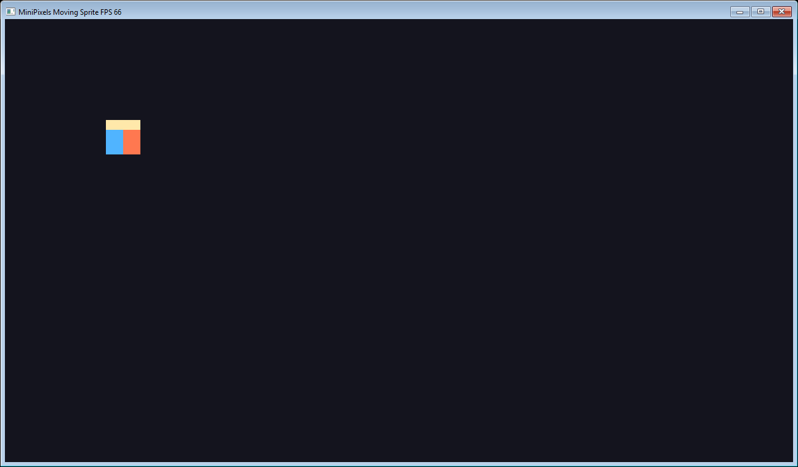
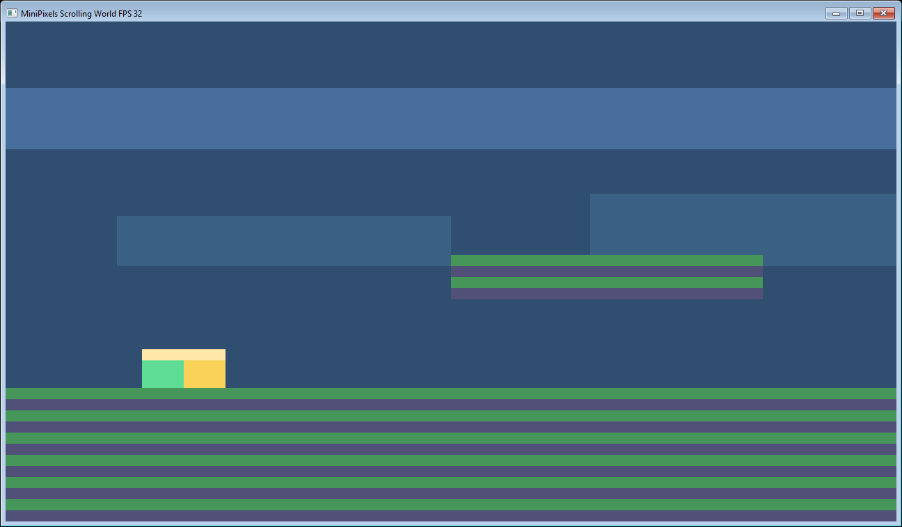
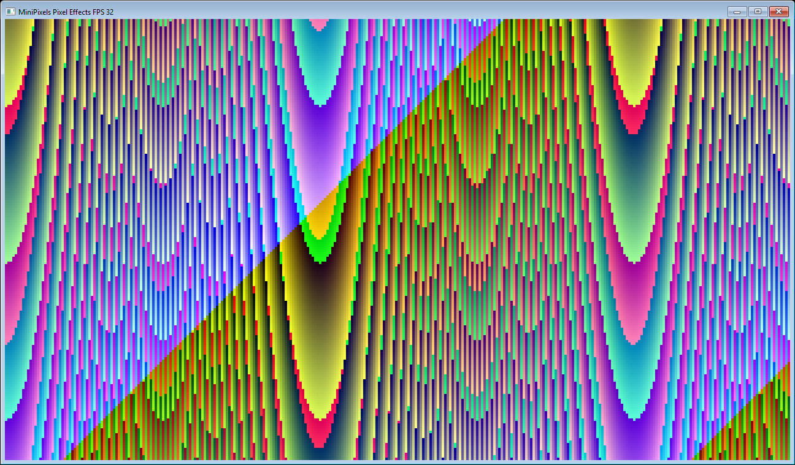
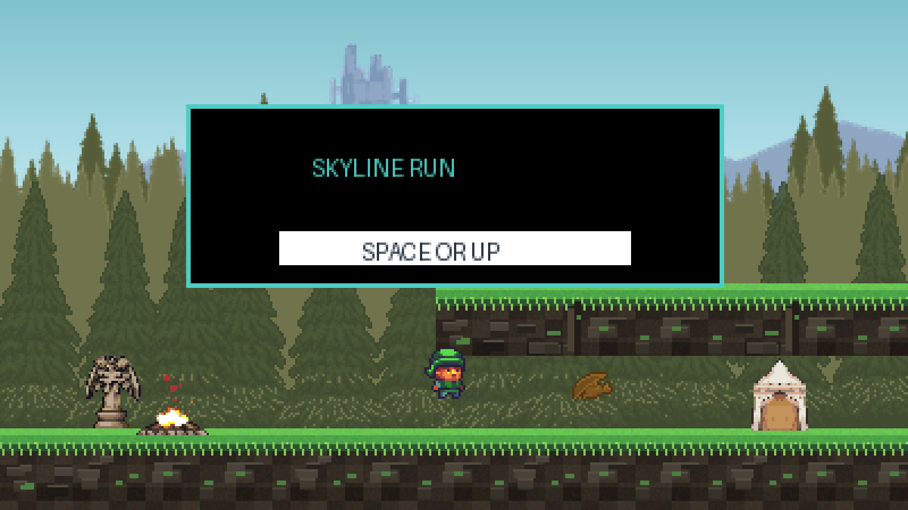
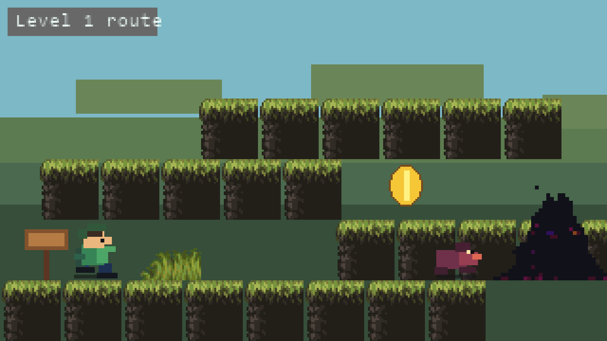
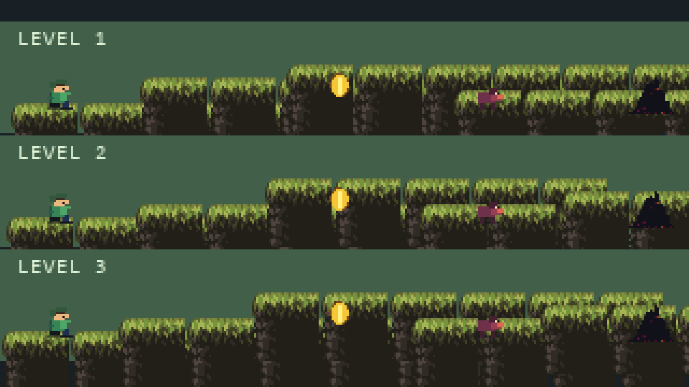
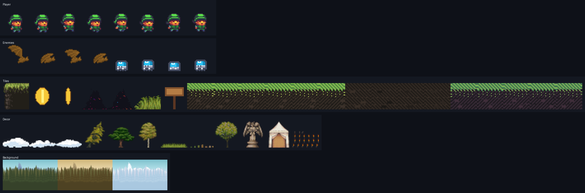

# Examples

All examples are regular MiniPixels projects with a `minipixels.json`, MiniLang source files, and assets.

## Moving Sprite



Run:

```powershell
python tools\minipixels.py run examples\moving-sprite\minipixels.json --compiler ..\MiniLangCompilerPy\mlc_win64.py
```

MiniLang code excerpt:

```ml
function update(game, dt)
  global playerX, playerY
  speed = 90 * dt
  if game.input.left then playerX = playerX - speed end if
  if game.input.right then playerX = playerX + speed end if
  if game.input.up then playerY = playerY - speed end if
  if game.input.down then playerY = playerY + speed end if
end function

function render(game, canvas)
  canvas.clear(mp.rgb(20, 20, 30))
  canvas.drawSprite(playerSprite, playerX, playerY)
end function
```

## Scrolling World



Run:

```powershell
python tools\minipixels.py run examples\scrolling-world\minipixels.json --compiler ..\MiniLangCompilerPy\mlc_win64.py
```

MiniLang code excerpt:

```ml
rect = mp.recti(player.x, player.y, 12, 15)
res = mp.tileMoveAndCollide(world, rect, player.vx * dt, player.vy * dt)
player.x = res.x
player.y = res.y

if res.hitBottom then
  player.vy = 0
  player.grounded = true
end if

camera.follow(player.x, player.y)
```

## Pixel Effects



Run:

```powershell
python tools\minipixels.py run examples\pixel-effects\minipixels.json --compiler ..\MiniLangCompilerPy\mlc_win64.py
```

MiniLang code excerpt:

```ml
while y < canvas.height
  x = 0
  while x < canvas.width
    v = ((x * x) + (y * 3) + phase * 7) & 255
    canvas.setPixel(x, y, mp.rgb((v + x) & 255, (v + y) & 255, 120))
    x = x + 1
  end while
  y = y + 1
end while
```

## Jump and Run









Run:

```powershell
python tools\minipixels.py run examples\jump-and-run\minipixels.json --compiler ..\MiniLangCompilerPy\mlc_win64.py
```

What it demonstrates:

- Main menu, win screen, and retry screen
- Three hand-authored scrolling levels
- Player movement, jumping, gravity, tile collision, and camera follow
- Coins, enemies, stomp combat, locked exits, level intros, particle bursts, and level transitions
- Sprite-sheet animation, stateful SFX playback, HUD text, and camera-space drawing helpers
- Open/free asset workflow with compact generated MiniLang assets, manifest sheet metadata, generated level data, and build-time asset reports

MiniLang code excerpt:

```ml
rect = mp.recti(player.x + 6, player.y + 3, 18, 29)
res = mp.tileMoveAndCollide(world, rect, player.vx * dt, player.vy * dt)
player.x = res.x - 6
player.y = res.y - 3

if res.hitBottom then
  player.vy = 0
  player.grounded = true
else
  player.grounded = false
end if

if rectHit(player.x + 6, player.y + 3, 18, 29, exitX, exitY, 32, 64) and coinsTaken >= coinCount then
  loadLevel(levelIndex + 1)
end if

mp.drawSpriteWorld(canvas, camera, playerSheet.getFrame(pframe), player.x, player.y)
```

Level data lives in `examples/jump-and-run/assets/levels/levels.json` and is compiled into `generated.levels` during the build.

Assets:

- World, tile, portal, grass, and sign graphics are adapted from GandalfHardcore FREE Platformer Assets: https://gandalfhardcore.itch.io/free-pixel-art-sidescroller-asset-pack-32x32-overworld
- The checked-in sheets are compact runtime assets for this example, not a redistribution of the original ZIP.
- The small example sounds were generated for MiniPixels and are released as CC0 with the example.
