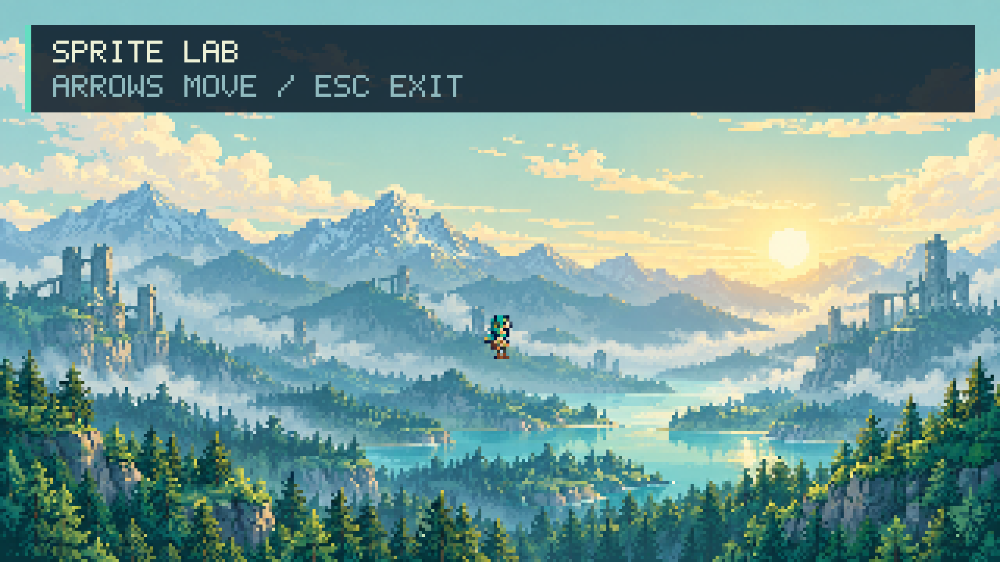
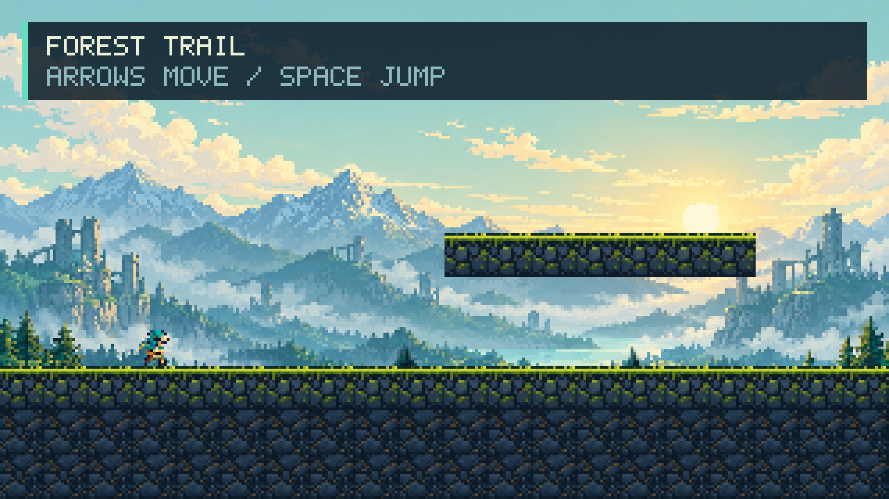
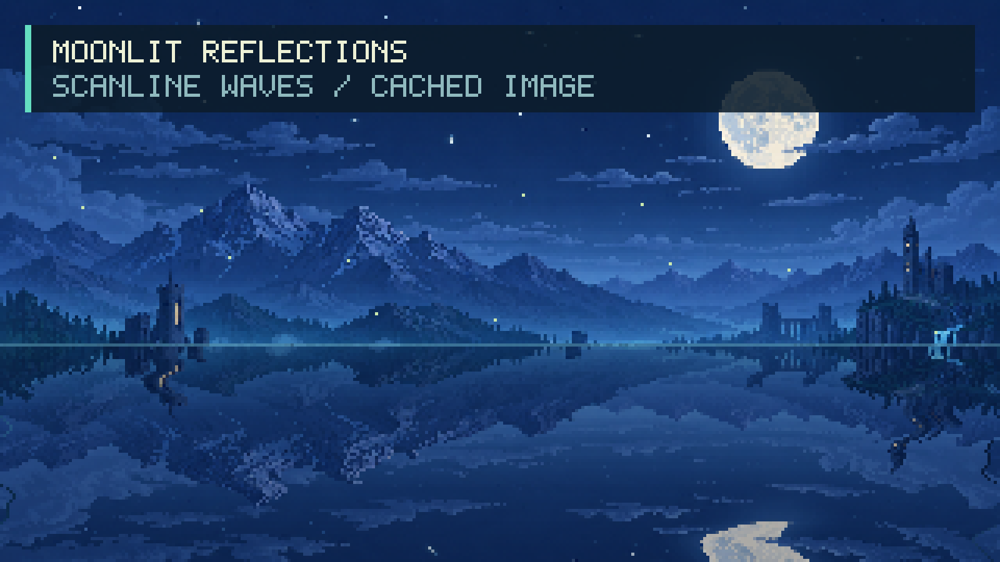
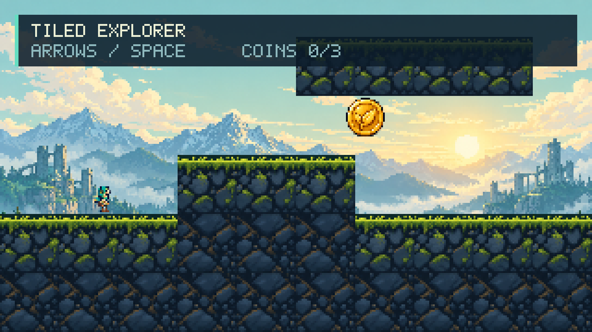
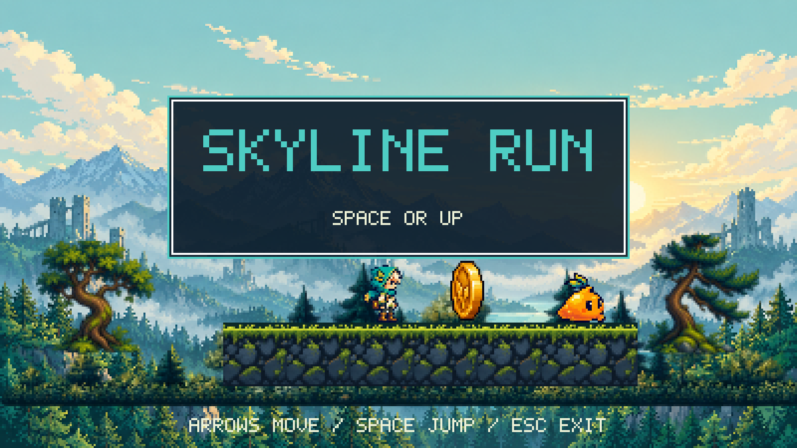
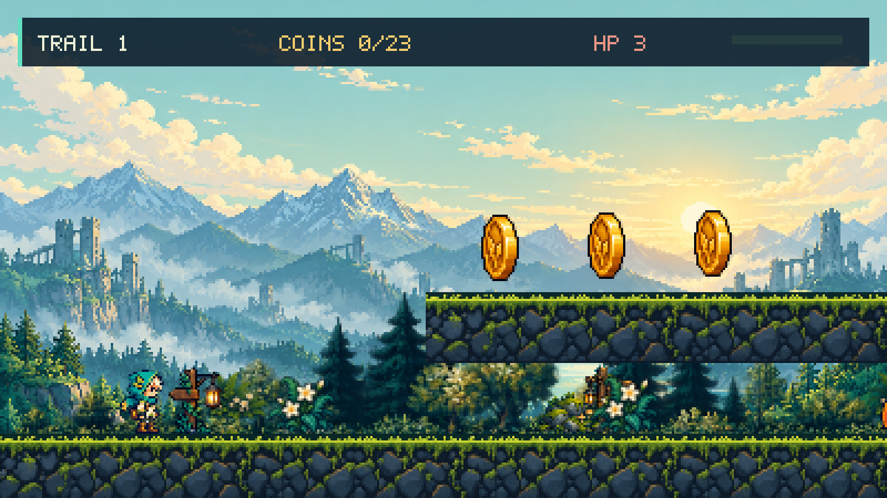
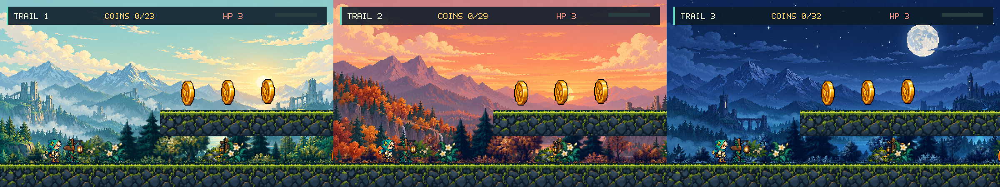
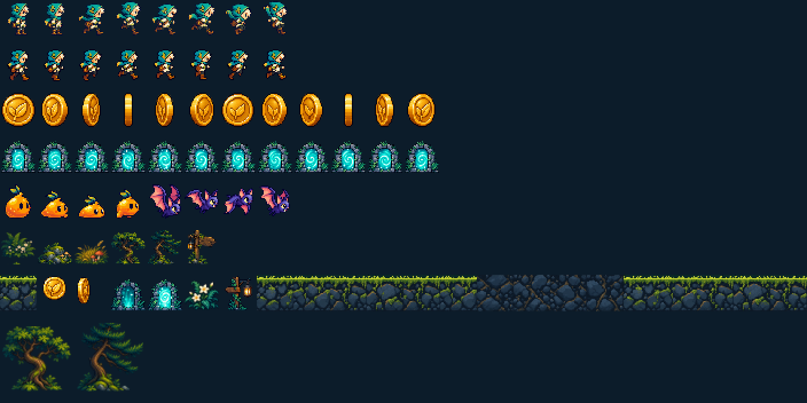

# Examples

All examples are regular MiniPixels projects with a `minipixels.json`, MiniLang source files, and assets.

They share newly generated forest-adventure pixel art. Runtime sprite sheets,
backgrounds, and props are checked in; ordinary game builds do not run image
generation. Original artwork, prompts, and the reproducible preparation pipeline
are in [`examples/_art`](../examples/_art/README.md).

## Moving Sprite



Run:

```powershell
python tools\minipixels.py run examples\moving-sprite\minipixels.json --compiler ..\MiniLangCompilerPy\mlc_win64.py
```

MiniLang code excerpt:

```ml
function update(game, dt)
  global playerX, playerY
  speed = 90 * dt
  if game.input.left then playerX = playerX - speed end if
  if game.input.right then playerX = playerX + speed end if
  if game.input.up then playerY = playerY - speed end if
  if game.input.down then playerY = playerY + speed end if
end function

function render(game, canvas)
  canvas.drawSprite(background, 0, 0)
  canvas.drawSprite(playerSprite, playerX, playerY)
end function
```

## Scrolling World



Run:

```powershell
python tools\minipixels.py run examples\scrolling-world\minipixels.json --compiler ..\MiniLangCompilerPy\mlc_win64.py
```

MiniLang code excerpt:

```ml
rect = mp.recti(player.x, player.y, 12, 15)
res = mp.tileMoveAndCollide(world, rect, player.vx * dt, player.vy * dt)
player.x = res.x
player.y = res.y

if res.hitBottom then
  player.vy = 0
  player.grounded = true
end if

camera.follow(player.x, player.y)
```

## Pixel Effects



A moonlit landscape is loaded once from MPX. Animated reflected scanlines use
`blitRegion`, with a translucent water tint and a handful of firefly pixels. The
scene illustrates image reuse and inexpensive animation without generating a new
image or calculating a full-screen per-pixel effect each frame.

Run:

```powershell
python tools\minipixels.py run examples\pixel-effects\minipixels.json --compiler ..\MiniLangCompilerPy\mlc_win64.py
```

## Tiled Platformer



Run:

```powershell
python tools\minipixels.py run examples\tiled-platformer\minipixels.json --compiler ..\MiniLangCompilerPy\mlc_win64.py
```

What it demonstrates:

- Tiled JSON/TMJ level input through `levels.path`
- Collision tile layer import
- Object-layer `spawn`, `exit`, `coin`, and `enemy` records
- Packed image assets for the player, coins, portal, and terrain
- Separate visual tile selection and collision data, keeping grass on exposed tops

## Jump and Run









Run:

```powershell
python tools\minipixels.py run examples\jump-and-run\minipixels.json --compiler ..\MiniLangCompilerPy\mlc_win64.py
```

What it demonstrates:

- Main menu, win screen, and retry screen
- Three hand-authored scrolling levels
- Player movement, variable-height jumping, one-way tile platforms, and camera follow
- Coyote time, jump buffering, and distance-driven run animation independent of render FPS
- A registered eight-pose running sheet with equally timed contact/support/push/flight half-strides
- Twelve-phase coin rotation (1.2 seconds) and portal energy loop (1.8 seconds), independent of render FPS
- Native 64px foreground trees rendered 1:1, with area-sampled foliage matching the scene's finer pixel detail
- Damped camera tracking with a vertical dead zone and ground-anchored parallax trees
- Grounded slime patrols with ledge detection, and separate flying bat animations
- Coins, enemies, stomp combat, locked exits, level intros, particle bursts, and level transitions
- Sprite-sheet animation, stateful SFX playback, HUD text, and camera-space drawing helpers
- Generated-art asset workflow with MiniPixels `assets.mpx` packs, manifest sheet metadata, generated level data, and Python build-time asset reports

MiniLang code excerpt:

```ml
import "gameplay.ml" as play

jumped = play.stepPlayer(player, world, game.input.left, game.input.right,
                        game.input.jump or game.input.up, dt)
if jumped then mp.playAudio(game.audio, jumpSfx) end if
pframe = play.playerFrame(player)
sprite = playerSheet.getFrame(pframe)
if player.grounded and player.vx != 0 then sprite = playerRunSheet.getFrame(play.playerRunFrame(player)) end if
mp.drawSpriteWorld(canvas, camera, sprite, player.x, player.y + 1)
```

Hold Space/Up for a full jump (about 108px), release early for a shorter hop.
Floating platforms can be entered from below and support the player on descent.
The example-specific `src/gameplay.ml` keeps fractional positions and uses 120Hz
movement substeps; it does not change the engine's normal solid tile collision API.
Wider landing zones and repositioned end-of-level coins allow a route through all
84 coins and all exits. `tests/jump_and_run_tests.ml` simulates that route using the
same movement code and actual level data, and checks adjacent platform jumps,
slime patrols, grounding, animation states, buffering, and coyote time. Reachability
tests isolate geometry from combat; they are not an invulnerable game mode.

Camera tracking uses retained subpixel spring state and a vertical quiet band
(72-180 screen pixels for the player's center). It does not recenter on every
jump or landing. The forest layer's roots are anchored eight pixels behind the
world ground, keeping the trees visible as the camera moves vertically. Regression
tests cover landing/walk-off stability, bounded movement, and timestep-independent damping.

Level data lives in `examples/jump-and-run/assets/levels/levels.json` and is compiled into `generated.levels` during the build. Image/audio/file assets are written to `build/assets.mpx`; generated MiniLang image factories decode packed PNG payloads, and audio helpers load memory-backed clips. The Python build can transcode source WAVs to MP3 automatically. The native MiniLang CLI can generate the asset/level modules and unprotected packs too; use the Python driver for protected packs and the full build/run pipeline.

Current graphics were generated with the built-in image-generation tool and then
cropped, scaled, and assembled into the existing frame layouts. The previous
third-party graphics have been replaced; their attribution files remain for older
releases. The small example sounds are unchanged and retain their CC0 notice.

## Reproduce the gallery

```sh
python tools/build_examples.py
python tools/capture_examples.py --update-docs
```

For Linux, pass `--target linux-x64` to both commands. Capture runs 60 deterministic
headless engine frames per scene, validates all five examples and all three Jump
and Run levels, and writes a contact sheet to `build/example-previews/overview.png`.
The same capture smoke checks run on Windows and Linux in CI. Individual executables
also accept `--screenshot output.png`; Jump and Run additionally accepts
`--screenshot output.png play 0` (level indices 0, 1, or 2).

For animation review, Jump and Run accepts `--motion-preview path/prefix` and
records a deterministic three-second run/jump/land sequence as 36 PNG frames
(`prefix-5.png` through `prefix-180.png`). Create the destination directory first.
Add `portal` after the prefix to capture the animated exit and nearby coins instead.
